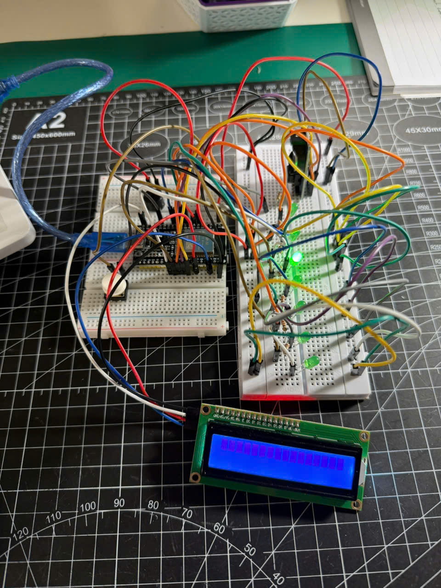
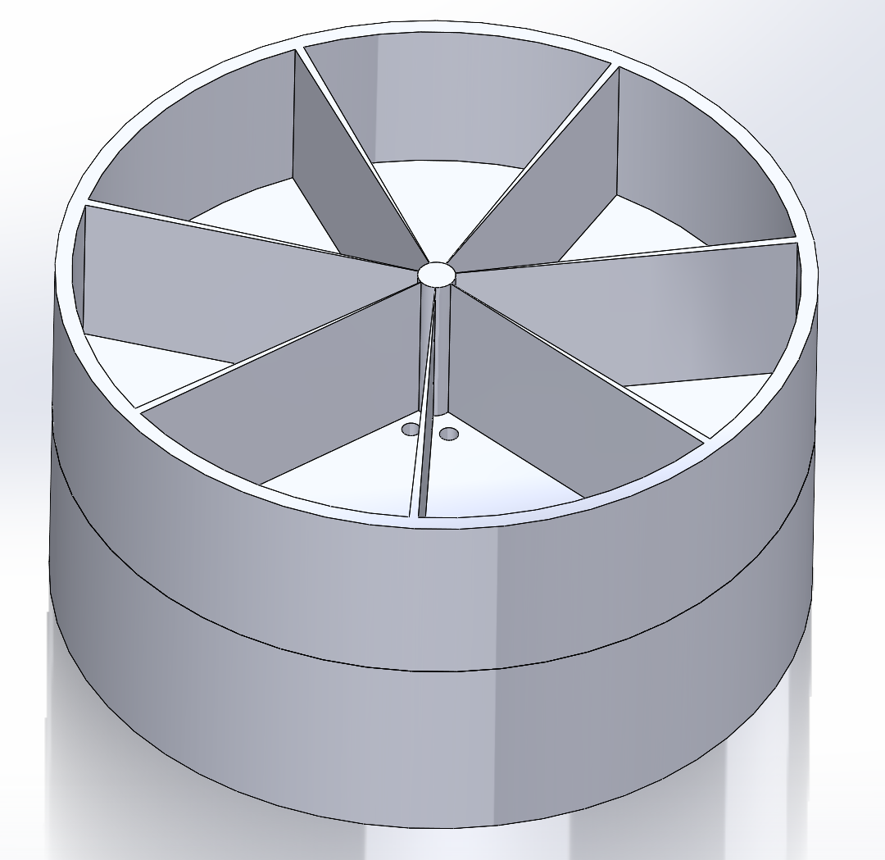
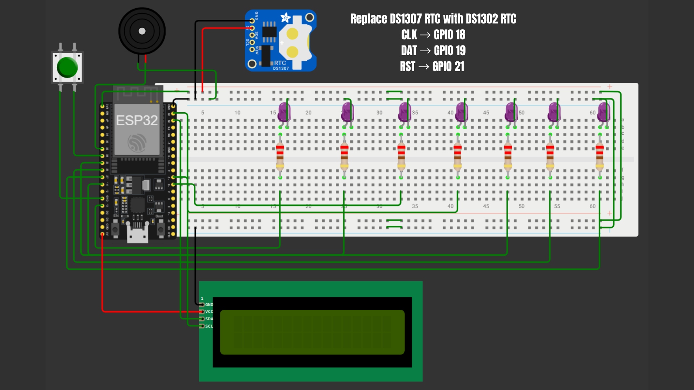

# Smart Pill Dispenser
An ESP32 based smart medication reminder and pill dispensing assistant designed for elderly users.

The system uses:
- RTC timekeeping
- LCD display
- LEDs
- buzzer alarms
- push button interaction
Purpose: to remind elderly with dementia when medication should be taken.

## Features
- Real time medication reminders
- Visual LED indicators
- Audible buzzer alarm
- LCD medication display
- Button acknowledgement system
- Battery powered operation

## Hardware
- ESP32 Dev Module
- DS3231 RTC
- 16x2 I2C LCD
- LEDs
- Push buttons
- Passive buzzer
- 18650 battery
- TP4056 charger module

## Prototype

## Wiring Diagram

The circuit was designed and simulated using Wokwi. The Wokwi project archive is available in the `simulation/` folder.
